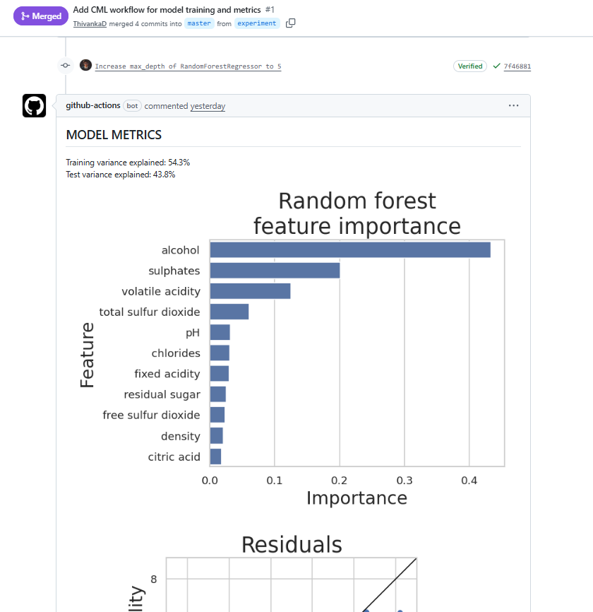
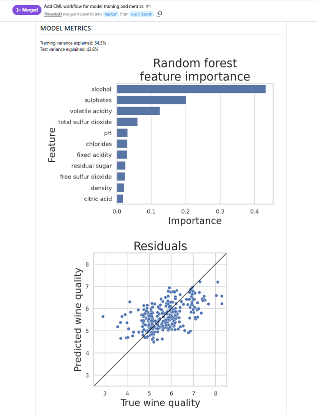

# Wine quality prediction
Modelling a Kaggle dataset of [red wine properties and quality ratings](https://www.kaggle.com/uciml/red-wine-quality-cortez-et-al-2009). 

## Continuous Machine Learning (CML) Report

This project uses [CML](https://cml.dev/) to automatically generate model metrics and visualization reports on every push. When you open a Pull Request (PR) for an experiment branch, a CML  will post a comment containing:

- **Model Metrics**: Training and test variance explained.
- **Visualizations**: Feature importance and residuals plots.

This automated reporting allows you to compare experiments and make data-driven decisions about model performance directly in the Pull Request.

## Results

